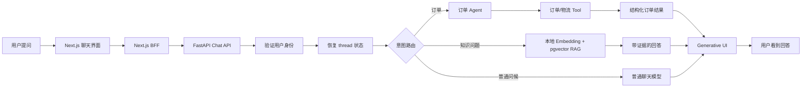

# 电商智能客服项目总览

> 当前版本：V0.8（前端接入与验收中）
> 更新日期：2026-09-01

这份文档回答三个问题：系统为用户解决什么问题、一次请求是怎样流转的、为什么每个版本要按现在的顺序演进。

## 1. 先从业务闭环理解项目

用户在聊天窗口提出问题，系统根据问题类型选择一条业务路径：

具体业务上，系统要守住四个不变量：

1. 订单只能被当前认证用户访问，不能由模型自己传入用户身份。
2. 退款等高风险操作不能绕过金额、订单状态、客户确认和人工审批。
3. 知识回答只能使用实际检索到的企业资料；订单问题不应该被无关 RAG 结果污染。
4. 网络重试、浏览器刷新或服务重启不能导致重复操作，也不能丢失会话上下文。

## 2. 当前代码的职责边界

项目不是“每个文件都是一个 Agent”。当前更准确的说法是：一个 LangGraph 工作流里有多个角色和业务节点。

### 前端 `apps/web`

- 展示聊天、订单、物流、退款和知识库证据。
- 通过 BFF 调用后端，不暴露后端地址、JWT 密钥或内部用户身份。
- 根据结构化结果渲染订单卡片、物流时间线、退款状态和 citations。
- 处理加载、错误、取消、重试和 reduced-motion 等交互状态。

### 后端 `apps/agent-core`

- `api/routes`：HTTP/SSE 边界，只负责认证、参数和响应序列化。
- `services`：面向业务用例的编排，例如聊天、订单、退款。
- `agents/support_graph.py`：LangGraph 状态、意图路由、订单节点和 RAG 条件节点。
- `tools`：模型可以调用的受控动作，例如查询订单；工具从认证上下文取得 `user_id`。
- `rag`：文档解析、切片、Embedding、pgvector 检索、RRF 融合和引用追踪。
- `core`：配置、数据库连接和应用生命周期。

### 数据层

- Prisma 管理传统业务表：用户、订单、物流、退款申请等。
- Agent Core 的 SQLAlchemy 读写 Agent 专属表：Checkpoint 和知识块。
- PostgreSQL 同时承担业务数据、LangGraph 状态、向量数据和幂等约束。

## 3. 一次聊天请求究竟发生什么

以“查一下订单 order-demo-001”为例：

1. 前端发送 `message`、`thread_id` 和 `request_id`。
2. BFF 转发请求并附带服务端签发的短期 demo JWT。
3. FastAPI 验证 JWT，从可信的 `sub` 得到 `user_id`。
4. ChatService 以 `user_id + thread_id` 恢复 LangGraph checkpoint。
5. Graph 读取原始用户消息并判断意图为 `order`。
6. 订单 Agent 调用订单 Tool；Tool 只能按 `order_id + user_id` 查询。
7. 订单结果写回状态并缓存到 `request_id` 对应的幂等记录。
8. API 返回结构化订单数据，前端直接渲染卡片和物流时间线。

以“退款政策是什么”为例，前 5 步相同，但 Graph 进入知识分支：

1. 本地 LlamaIndex Embedding 生成查询向量。
2. PostgreSQL 同时执行语义检索和关键词检索。
3. RRF 合并候选，保留来源、页码、chunk ID 和融合排序分。
4. 只有实际使用过的证据才进入回答和 `citations`。
5. 前端展开证据区域，用户可以回看原文出处。

## 4. 三个 ID 不要混淆

| 标识 | 作用 | 生命周期 | 是否代表身份 |
|---|---|---|---|
| `user_id` | 当前登录用户和资源归属 | 用户/请求 | 是，来自验签 JWT |
| `thread_id` | 一段对话及其 checkpoint | 会话 | 否 |
| `request_id` | 一次请求的幂等键 | 单次请求/重试窗口 | 否 |

另外，`order_id` 是业务订单标识，`chunk_id` 是知识库文档片段标识。它们都不能替代 `user_id` 做权限判断。

## 5. 为什么版本要这样排列

项目按“先让一个闭环工作，再遇到问题后抽象”的学习路线推进，而不是一开始就搭完整企业架构。

| 阶段 | 版本 | 解决的问题 | 学到的主概念 |
|---|---|---|---|
| 能聊天 | V0.1 | 前后端如何完成一次请求 | FastAPI、Next.js、依赖注入、错误边界 |
| 有业务数据 | V0.2 | 客服如何可靠查询订单和物流 | SQL、用户归属、404/503、读写边界 |
| 不丢上下文 | V0.3 | 重启和重试后如何恢复 | LangGraph State、Checkpoint、幂等 |
| 会调用工具 | V0.4 | 模型如何选择订单动作并流式返回 | JWT、Router、Tool Calling、SSE |
| 能安全处理钱 | V0.5 | 退款如何被确认和审批 | Decimal、状态机、原子更新、风控 |
| 有事实依据 | V0.6 | 知识回答如何引用企业文档 | Chunking、Embedding、pgvector、Hybrid Search |

每版都包含同一条验收链：正常路径、错误路径、关键边界、自动化测试、前后端联调和人工验收。

## 6. 当前已经完成什么，尚未完成什么

### 已完成的 MVP 能力

- 聊天闭环、会话恢复、JWT 用户归属和 SSE。
- 订单查询、物流时间线、订单 Tool Calling。
- 退款风控、客户确认、人工审批和幂等保护。
- 本地多语言 Embedding、PDF/Markdown 导入、pgvector 混合检索。
- 知识回答 citations，以及订单路径跳过 RAG 的编排规则。
- 前端 Generative UI 和错误/加载/重试交互。

### 仍属于演示或 MVP 边界

- BFF 使用 demo JWT，还没有正式登录、刷新令牌和 RBAC。
- SSE 是完整 assistant 事件，不是逐 token 的真正 token streaming。
- 退款审批完成后没有接入真实支付渠道。
- RAG 还没有文档权限过滤、后台上传队列、全文索引和大规模评估集。
- 当前是“角色化的单工作流”，还不是多个可以独立部署、独立观测的 Agent。

## 7. 下一阶段 V0.7：可靠性加固与 Redis 入门

V0.7 不再急着增加新的业务动作，而是把已有订单、退款和 RAG 变成可以长时间运行的服务，同时用一个低风险场景学习 Redis。Redis 不承担订单、退款、Checkpoint 或幂等记录的最终事实，这些仍然由 PostgreSQL 负责。建议按下面顺序，一次只解决一个可观察问题：

1. **先复现慢任务问题**：让一个退款或文档导入任务在请求超时后仍能继续。
2. **引入最小后台任务表**：请求只创建任务并返回状态，Worker 负责执行。
3. **增加任务状态机**：`PENDING -> RUNNING -> SUCCEEDED/FAILED`，并记录重试次数和错误摘要。
4. **处理重复投递**：用幂等键和唯一约束保证同一任务不会重复退款或重复写入。
5. **加入 Outbox**：业务事务提交时同时记录待发送事件，避免“数据库成功但通知丢失”。
6. **接入 Redis 做只读缓存**：先学习 key、序列化、TTL、连接池和 cache-aside；选择 RAG 检索结果或健康状态这类可过期数据，不缓存退款写操作。
7. **设计缓存失效**：知识库 rebuild 后清理对应缓存；Redis 不可用时回退 PostgreSQL/原始计算，并记录可观测日志。
8. **验证并发和恢复**：覆盖两个请求同时审批、Worker 重启、数据库回滚、重复 webhook 和缓存击穿边界。
9. **补可观测性**：为 `request_id`、`thread_id`、任务 ID 和 Redis cache hit/miss 建立脱敏日志与基础指标。

V0.7 的 Redis 学习重点是“临时加速层”，不是把 Redis 当作第二个数据库。完成后，系统才适合继续做正式认证、真实支付、文档权限和规模化检索评估。

## 8. V0.8～V1.0 后续路线

这三版现在正式纳入主路线。每版仍然遵循“先出现具体问题，再引入工具或抽象”的学习方式。

### V0.8：正式身份与权限

V0.4 的 demo JWT 只验证了资源归属概念，V0.8 才把它变成可使用的登录系统：

- 后端：登录、密码哈希或身份提供商、Access/Refresh Token、退出和 RBAC。
- 数据边界：用户只能访问自己的订单、退款、会话和有权限的知识文档。
- 前端：登录状态、过期处理、重新认证和无权限页面。
- 验收：越权订单、越权 thread、越权 citation、过期 token 和刷新 token 失败。

本版不接真实支付，也不引入多租户计费。

### V0.9：Redis 分布式能力

V0.7 先用 Redis 学习只读缓存；V0.9 再在确有需求时扩展到分布式场景：

- 按用户或 IP 限流，保护聊天和 RAG 接口。
- 多 Worker 共享的短期状态、Pub/Sub，或 Redis 任务队列，先选择一个场景完成。
- 学习连接池、键空间设计、TTL、序列化、故障降级和数据淘汰。
- 验收 Redis 重启、连接超时、重复投递、限流边界和多进程可见性。

Redis 仍不是订单、退款、Checkpoint 或幂等记录的唯一存储。

### V1.0：真实业务副作用

这一版才让“申请退款”连接到可控的支付沙箱：

- 支付退款适配器、签名 webhook、对账和审计日志。
- 退款任务异步执行，支持重试、补偿、人工介入和最终一致性。
- 前端展示处理中、成功、失败、补偿中等真实状态。
- 验收支付超时、重复 webhook、签名错误、部分失败和审批后服务重启。

生产支付密钥和真实扣款仍不进入自动化测试，只做用户配置沙箱后的手动 smoke test。

### V1.1：质量与运营

- 建立 RAG 问答评估集、拒答率、引用准确率、工具成功率、延迟和成本指标。
- 增加脱敏 tracing、管理员审计查询和故障告警。

### V1.x：何时拆成真正的 Multi-Agent

只有当订单、退款、知识和人工协作在提示词、工具、权限、重试或部署节奏上产生明显分叉时，才把当前 Graph 节点拆成独立 Agent。拆分依据是已观察到的维护痛点，而不是预先把目录分得更细。

拆分的判断标准是“当前边界已经产生具体痛点”，而不是“目录看起来更企业级”。

## 9. 推荐的学习和开发节奏

后端继续使用教学模式：每次只学习一个主要概念，先由用户写最小业务代码，再由测试暴露问题，最后按实际压力抽取模块。前端可以并行实现，但必须以稳定的结构化接口为准，不通过解析模型自然语言猜订单或退款状态。

每完成一个版本，固定回答五个问题：

1. 用户现在能完成哪一个完整业务动作？
2. 哪个错误或边界场景被自动化测试保护？
3. 哪个状态需要持久化，谁拥有它？
4. 哪个外部副作用仍然是假实现或手动 smoke test？
5. 下一版是由什么具体痛点驱动，而不是预先设计了什么目录？

这五个问题就是项目从学习代码逐步走向企业级系统的主线。
